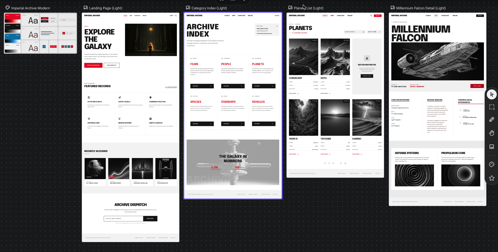

# SWAPI Explorer

This project is a small SWAPI Explorer app built with Next.js and TypeScript.
I made it to browse SWAPI data by category, search records, sort results, and
open a detail page for each item.

## What this app does

- browse all main SWAPI categories
- search inside a category
- sort by name or title
- open detail pages
- view related items
- keep recent category
- show loading states while data is being fetched

## Rendering

- uses SSR for category and detail routes
- uses App Router (`src/app`)

## State behavior

- search and sort state is stored in URL query params
- state is kept per category (for example: planets search does not overwrite people search)
- recent category is stored in cookie (`recentCategory`)


## Main stack

- Next.js
- TypeScript
- CSS Modules
- SWAPI

## Scripts

```bash
npm run dev
npm run build
npm run start
npm run lint
```

## Run locally

```bash
npm install
npm run dev
```

Open `http://localhost:3000`

## Build

```bash
npm run build
npm run start
```

## Project structure

- `src/app`  
  app routes

- `src/components`  
  reusable UI and page parts

- `src/modules`  
  feature logic for category and detail pages

- `src/services`  
  SWAPI fetch functions

- `src/utils`  
  small helper functions

- `src/app/api/resources/[category]`  
  API route used by the app

## Notes

- used simple comments only where the code needed a quick reason.
- kept the styling in CSS modules.
- The app uses SWAPI data and turns relation URLs into normal UI sections.

## Accessibility

- keyboard focus styles are enabled
- skip link is included for main content
- loading states are announced and visible
- mobile menu and detail modal support keyboard navigation

## AI usage

- Used AI to explore multiple UI directions and quick layout ideas before implementation.
- Used Google Stitch to create early wireframe concepts.
- Used AI to draft loading skeleton structure and placeholder layout patterns.
- Used AI to generate and refine SVG illustration assets (category and transport visuals).
- Used AI to suggest copy simplification for headings, labels, and helper text.
- Used AI to speed up CSS iteration (spacing, responsive behavior, and visual consistency checks).

## Design reference

This is the design direction I used while building the UI:



## Author

Pradeep Tamang  
https://pradeeptamang.com.np
